# Overview
This Project 'Building a CI/CD Pipeline' Project as a part of DevOps Engineer using Microsoft Azure Nanodegree Program. This project explores the capabilities of AzureCloud Shell, integrating the github with Azure Devops Pipeline and deploying a webapp.

## Project Plan

* A [Trello](https://trello.com/b/UO8mjd9V) board for the project has been created and tracked
* A [spreadsheet](project-management-template.xlsx) that includes the original and final project plan

## Instructions
 
### Architectural Diagram
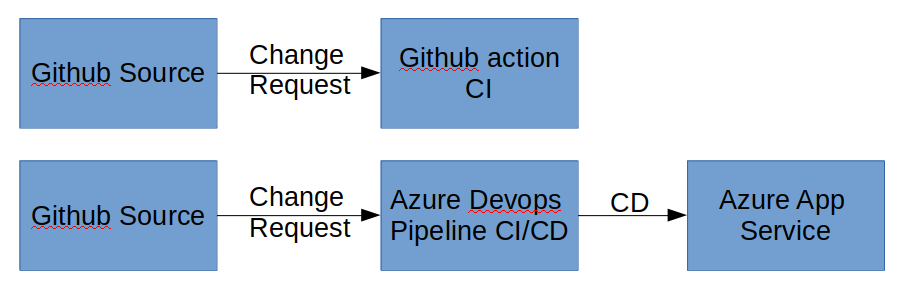
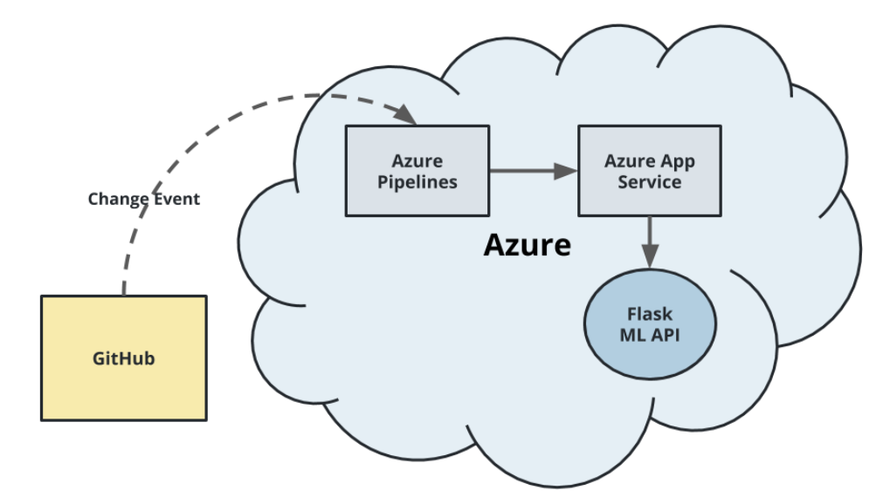

### Project running on Azure App Service

Goal of this project is to run the Azure App Service with CI/CD Pipeline, so one can easily integrate and deploy the latest version.


### Project cloned into Azure Cloud Shell
Use Azure Shell to clone the repository which was created in github
``` bash
ssh-keygen -t rsa

# copy the public key and paste it in the github ssh for access

#c lone the github repository
git clone <github repository>

```
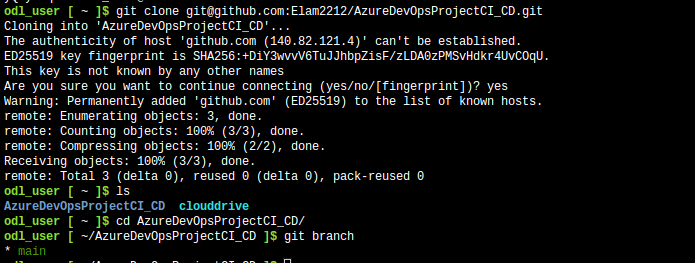

* Passing tests that are displayed after running the `make all` command from the `Makefile`
``` bash
# create Makefile and requirement.txt with appropriate packages as mentioned in the project description
# run make all to test all the requirment, linking and tests
make all
```
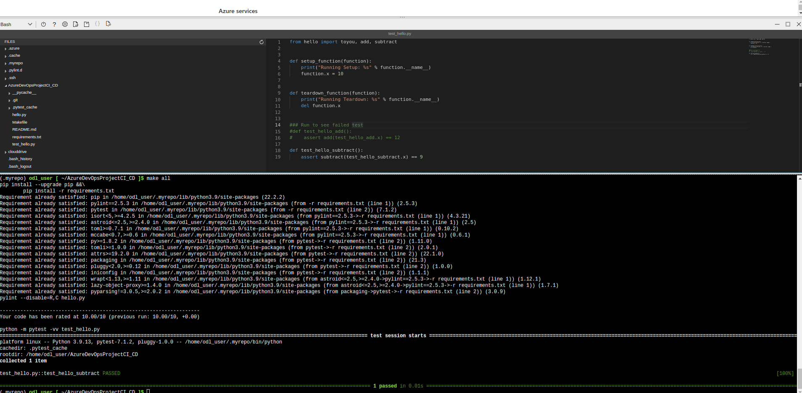

* Output of a test run
Output of the test run can be seen in the above mentioned image. We can now introduce github actions feature for automatizing the continuous integration tool chain. For that one need to create .yml file in github action and output of the github action can be found below for every commit.

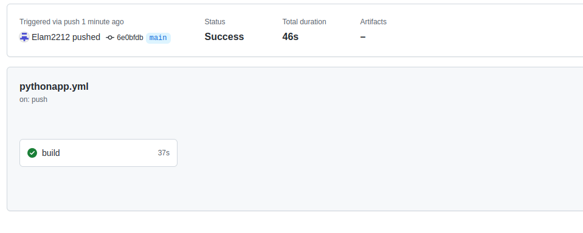
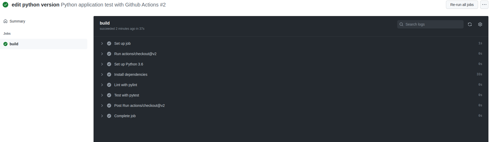

### Azure Devops Pipeline
* Successful deploy of the project in Azure Pipelines.  [Note the official documentation should be referred to and double checked as you setup CI/CD](https://docs.microsoft.com/en-us/azure/devops/pipelines/ecosystems/python-webapp?view=azure-devops).

1. Go to Azure Devops Organization and set policies to allow public repositories
2. Create a project
3. Create service connection to connect the azure account with devops account
4. Link the github account repository with the azure pipeline
5. Clone the repository in Azure Cloud Shell
6. Create Manual app, as described below, Running Azure App Service from Azure Pipelines automatic deployment
```bash
az webapp up --sku F1 --name webapp2212 --resource-group Azuredevops --runtime "PYTHON:3.7"
```
7. Change the webapp name in the make_predict_azure_app.sh
8. Run the make_prediction.sh and make_predict_azure_app.sh and output should look similer to the below,
```bash
udacity@Azure:~$ ./make_predict_azure_app.sh
Port: 443
{"prediction":[20.35373177134412]}
```
9. One need to create self hosted agent and virtual machine to create a build environment for toolchain
10. Modify the azure_pipelines.yml for running the CI/CD pipeline for every git action. 

* Successful prediction from deployed flask app in Azure Cloud Shell.  [Use this file as a template for the deployed prediction](https://github.com/udacity/nd082-Azure-Cloud-DevOps-Starter-Code/blob/master/C2-AgileDevelopmentwithAzure/project/starter_files/flask-sklearn/make_predict_azure_app.sh).

The Output of the Azure pipeline can be see below, 
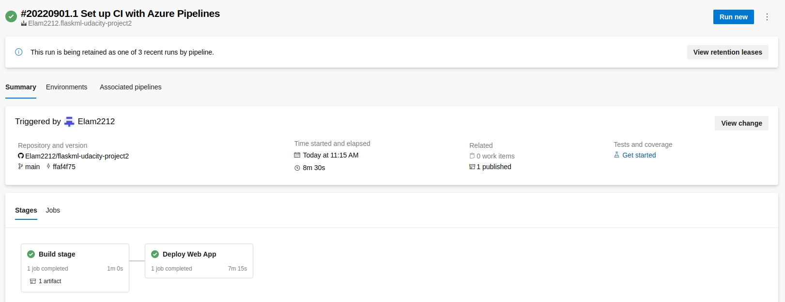
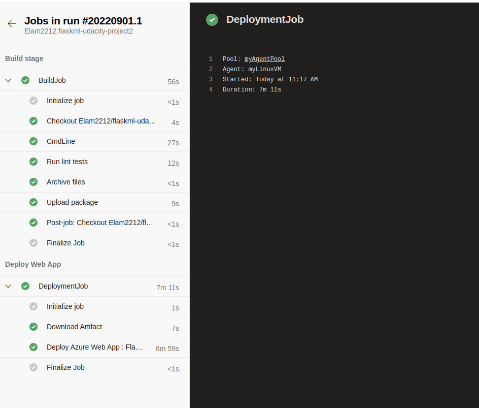

* Output of streamed log files from deployed application
```bash
az webapp log tail
```
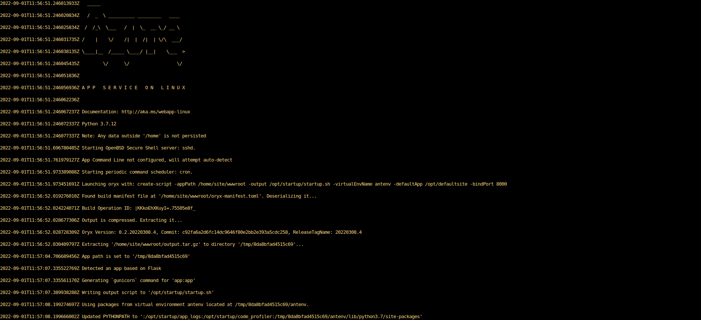
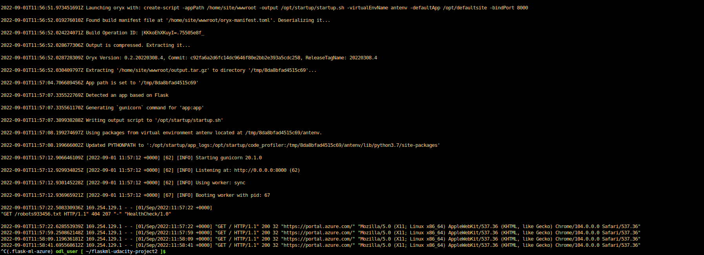

### Load Test
one can use Locust to test the load on the web app,
```bash
locust -f locustfile.py --headless -u 20 -r 5 -t 20s
```
Were, u denotes user, r denotes rate and t is timespan. One can see all the hits are predicted without any error. 
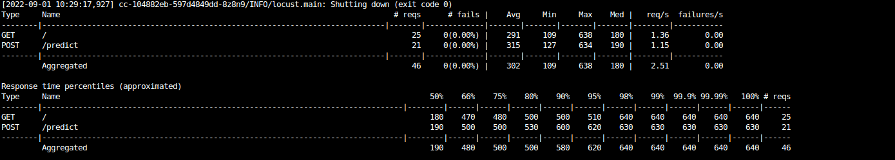

## Enhancements
1. The main improvement can be done in the pipeline, currently the pipeline works with the main branch, but can be imporved by testing and deploying in the staging environment in an other branch. This helps to secure production branch from unexpected output
2. Integrating load tests with the pipeline
3. Improving the prediction model for better accuracy

## Demo 
The Video explaing the project can be seen [here](https://youtu.be/tUFFsRecspY)


